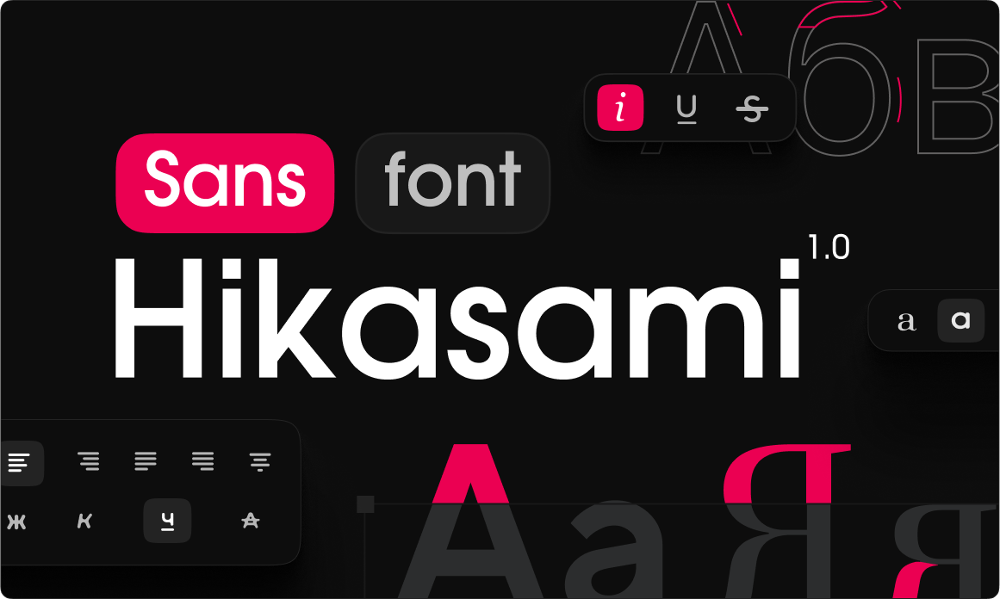

# Hikasami Sans

Hikasami Sans is a modern, geometric sans-serif typeface designed for legibility and simplicity. It combines readability, speed of perception and modern design to provide maximum reading comfort and visual pleasure.

Hikasami Sans is designed to be used in headlines, logos, posters, and other large display sizes, while maintaining excellent readability at smaller sizes.

### Installation

```sh
npm install @hikasami/font
```

### Using with Next.js

`HikasamiSans` is exported from `@hikasami/font/sans`. You can learn more by [reading the `next/font` docs](https://nextjs.org/docs/app/building-your-application/optimizing/fonts).

#### App Router

In `app/layout.js`:

```jsx
import { HikasamiSans } from "@hikasami/font/sans";

export default function RootLayout({
  children,
}) {
  return (
    <html lang="en" className={HikasamiSans.className}>
      <body>{children}</body>
    </html>
  )
}
```

#### Pages Router

In `pages/_app.js`:

```jsx
import { HikasamiSans } from "@hikasami/font/sans";

export default function MyApp({ Component, pageProps }) {
  return (
    <main className={HikasamiSans.className}>
      <Component {...pageProps} />
    </main>
  )
}
```

If you're using a version of Next.js that's older than 15, then in `next.config.js` or `next.config.mjs` add:

```diff js
/** @type {import('next').NextConfig} */
const nextConfig = {
  reactStrictMode: true,
+  transpilePackages: ["@hikasami/font"],
};

export default nextConfig;
```

This is required to fix errors like:

- `TypeError: next_font_local__WEBPACK_IMPORTED_MODULE_0___default(...) is not a function`
- `SyntaxError: Cannot use import statement outside a module`

#### With Tailwind CSS

`HikasamiSans` can be used through a CSS variable.

- `HikasamiSans`: `--font-hikasami-sans`

In `app/layout.js`:

```jsx
import { HikasamiSans } from '@hikasami/font/sans'

export default function RootLayout({
  children,
}) {
  return (
    <html lang="en" className={HikasamiSans.variable}>
      <body>{children}</body>
    </html>
  )
}
```

Then in `tailwind.config.js`:

```javascript
module.exports = {
  theme: {
    extend: {
      fontFamily: {
        sans: ['var(--font-hikasami-sans)'],
      },
    },
  },
}
```

### Font Weights

- **100-900** - Variable font with all weights

### License
The Hikasami Sans font is free and open sourced under the [SIL Open Font License](./LICENSE.TXT).

### Inspiration
Hikasami Sans has been influenced and inspired by the following typefaces: [Inter](https://rsms.me/inter), [SF Pro](https://developer.apple.com/fonts/), and [Suisse International](https://www.swisstypefaces.com/fonts/suisse/). We thank the creators of these typefaces for their craft.